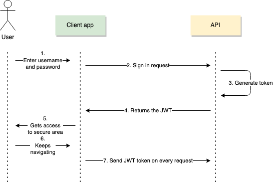
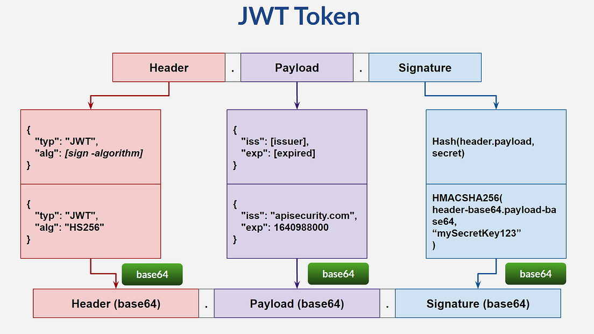
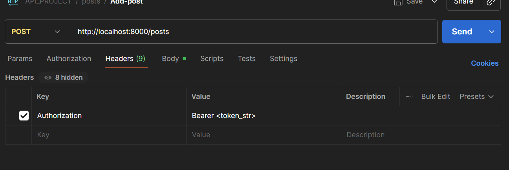

- [1 Coding CRUD](#1-coding-crud)
  - [1.2 Using Pydantic](#12-using-pydantic)
  - [1.3 Creating a global variable and retrieving the info stored in the variable (GET)](#13-creating-a-global-variable-and-retrieving-the-info-stored-in-the-variable-get)
  - [1.4 Getting post by id (GET)](#14-getting-post-by-id-get)
  - [1.5 Creating/adding a post with random id (POST)](#15-creatingadding-a-post-with-random-id-post)
  - [1.6 Returning a personalizaed Http status with and without HTTPException (GET)](#16-returning-a-personalizaed-http-status-with-and-without-httpexception-get)
  - [1.7 Delete post old/ new find post fucntion (DELETE)](#17-delete-post-old-new-find-post-fucntion-delete)
  - [1.8 Updating posts (PUT)](#18-updating-posts-put)
- [2 Data Base implementation](#2-data-base-implementation)
  - [Response pydantic v1.1.3](#response-pydantic-v113)
    - [We need to define the schema and serializer:](#we-need-to-define-the-schema-and-serializer)
    - [And update the code](#and-update-the-code)
      - [Multipole posts](#multipole-posts)
- [3 User  and password hashing v1.1.4](#3-user--and-password-hashing-v114)
  - [Creating user table](#creating-user-table)
  - [Creating api-endpoint/function add user](#creating-api-endpointfunction-add-user)
  - [Creating the pydantic schema for request and response](#creating-the-pydantic-schema-for-request-and-response)
  - [Hashing User Password](#hashing-user-password)
  - [Adding *Utils.py* file function call.](#adding-utilspy-file-function-call)
- [4 Splitting main.py using routers v1.1.5](#4-splitting-mainpy-using-routers-v115)
  - [Routing Prefix and tags](#routing-prefix-and-tags)
- [5 Tokens and login Flow v1.1.6](#5-tokens-and-login-flow-v116)
  - [JWT token components:](#jwt-token-components)
    - [Token obetention flow:](#token-obetention-flow)
  - [Login Flow](#login-flow)
    - [Code for the login](#code-for-the-login)
    - [Validating the password and the Email](#validating-the-password-and-the-email)
    - [Creating the token](#creating-the-token)
- [6 Verify user access and protect branches v1.1.7](#6-verify-user-access-and-protect-branches-v117)
      - [Login Flow](#login-flow-1)
- [6.1 Updateing get\_current\_user](#61-updateing-get_current_user)
- [7 Postman Features](#7-postman-features)
- [8 Sql Relationships v1.1.8](#8-sql-relationships-v118)
  - [Updated table foreign key](#updated-table-foreign-key)
  - [Using the get\_current\_user](#using-the-get_current_user)
- [9 Deleting, Updating and Getting your own posts and id and relationship v1.1.9](#9-deleting-updating-and-getting-your-own-posts-and-id-and-relationship-v119)
  - [Id relationship](#id-relationship)
- [10 Query para meters v1.1.10](#10-query-para-meters-v1110)

# 1 Coding CRUD

```python
 from fastapi import FastAPI #import the library
 from fastapi.params import Body

 app=FastAPI() #create instance of fastapi

 @app.get("/fran")#the route where to find the stuff /fran would be: http://127.0.0.1:8000/fran (decorator , endpoint)
 def root(): #root=funtion name (does not matter)
     return {"message": "Hello World"}

 @app.get("/posts")
 def get_posts():
     return{"data": "this is your posts"}

 @app.post("/createpost")
 def create_posts(payload: dict =Body(...)): #this gets the body from the post ,convert into a python dictionary and print save it into variable
     print (payload)
     return{"new_post": f"title: {payload['title']}"+" , succesfully created post"}


```

## 1.2 Using Pydantic

- Pydantic allows to define a schema for data validation, additionally, performs error handling

```python
from typing import Optional
from fastapi import FastAPI #import the library
from fastapi.params import Body
from pydantic import BaseModel

app=FastAPI() #create instance of fastapi

class Post (BaseModel): # here we use pydantic for define the schema
    title: str
    content: str
    published: bool = True # this is an optional/odefault to true
    rating: Optional[int]= None #Optional filed with no default value , type integer
    
    

@app.get("/fran")#the route where to find the stuff /fran would be: http://127.0.0.1:8000/fran (decorator , endpoint)
def root(): #root=funtion name (does not matter)
    return {"message": "Hello World"}

@app.get("/posts")
def get_posts():
    return{"data": "this is your posts"}

@app.post("/createpost")
def create_posts(new_post: Post): #We are refenrcing the Post class that validates if the post meets the scheme requirements(pydantic)
    print (new_post)# print is internal, we are not retunring info to the client.
    print (new_post.dict()) #Converting  the Pydantic model into a dict
    return{"message_from_server": "new post added, " f"title: {new_post.title}"} # accessing the title attribute of  new_poost

#title str, content str, category

```


## 1.3 Creating a global variable and retrieving the info stored in the variable (GET)

- At this moment the variable will act as DDBB
```python
from typing import Optional
from fastapi import FastAPI #import the library
from fastapi.params import Body
from pydantic import BaseModel

app=FastAPI() #create instance of fastapi

class Post (BaseModel): # here we use pydantic for define the schema
    title: str
    content: str
    published: bool = True # this is an optional/odefault to true
    rating: Optional[int]= None #Optional filed with no default value , type integer
    
my_posts= [{"id":1,"title": "this is the post 1","content":"content of post"},{"id":2,"title": "this is the post 2","content":"pizza"}] #creating a global variable for storing the posts in memory (not using ddbb)  it's an array/dict  

@app.get("/")#the route where to find the stuff /fran would be: http://127.0.0.1:8000/fran (decorator , endpoint)
def root(): #root=funtion name (does not matter)
    return {"message": "Hello World"}

@app.get("/posts")
def get_posts():
    return{"data": my_posts} #passing the variable

@app.post("/posts")
def create_posts(new_post: Post): #We are refenrcing the Post class that validates if the post meets the scheme requirements(pydantic)
    print (new_post)# print is internal, we are not retunring info to the client.
    print (new_post.dict()) #Converting  the Pydantic model into a dict
    return{"message_from_server": "new post added, " f"title: {new_post.title}"} # accessing the title attribute of  new_poost

#title str, content str, category
```
## 1.4 Getting post by id (GET)

```python

# function to find post

my_posts= [{"id":1,"title": "this is the post 1","content":"content of post"},
           {"id":2,"title": "this is the post 2","content":"pizza"}] #creating a global variable for storing the posts in memory (not using ddbb) its an array of dictionaries

def find_post(id):
    for i in my_posts:  # Iterates over dictionaries and returns the matching dictionary
        if i['id'] == id:
            return i  # Returns the matching dictionary if the condition is true
    print(id)
    return None  # In case no matching id is found

#retrieving post by id

@app.get("/posts/{id}")  # Get post per id (decorator/path parameter)
def get_post(id: int):#performing validation with fast api we are saying I want an integer.
    post = find_post(id)
    if post: #in python not empty values are considered as true same as: if post != {} (si no esta vacio... damelo else error)
        return {"post_info": post}  # Returns the entire post if found
    else:
        return {"error": f"Post not found. ID: {id}"}  # Returns an error message if no matching post is found

```
## 1.5 Creating/adding a post with random id (POST)

```python
my_posts= [{"id":1,"title": "this is the post 1","content":"content of post"},
           {"id":2,"title": "this is the post 2","content":"pizza"}]

@app.post("/posts") #adding the post to a dict and to the my_post array of dict
def create_posts(new_post: Post): #function expects new_post param. compliance with pydantic Post class
    post_dict=new_post.model_dump()# We create a dict witht the info we are gonna get
    post_dict['id']=randrange(0, 100000)#from that info the id is gonna be rand adding to the dictionary
    my_posts.append(post_dict)#here we are adding the new post with the rand id to the variable, addind the dictionary to the variable
    title=post_dict['title']
    return {"message_from_server": f"New post added: {post_dict}. Title: {title}"}
```

## 1.6 Returning a personalizaed Http status with and without HTTPException (GET)

 
```python
from fastapi import FastAPI, Response, status 

my_posts= [{"id":1,"title": "this is the post 1","content":"content of post"},
           {"id":2,"title": "this is the post 2","content":"pizza"}]

def find_post(id):
    for i in my_posts:  # Iterates over dictionaries and returns the matching dictionary
        if i['id'] == id:
            return i  # Returns the matching dictionary if the condition is true
    print(id)
    return None  # In case no matching id is found

#retrieving post by id

@app.get("/posts/{id}")  # Get post per id (decorator/path parameter)
def get_post(id: int,response: Response):#This generates an instance of Response class called "response"
    post = find_post(id)
    if post: #in python not empty values are considered as true same as: if post != {} (si no esta vacio... damelo else error)
        return {"post_info": post}  # Returns the entire post if found
    else:
        raise HTTPException(status_code=status.HTTP_404_NOT_FOUND, detail={"error": f"Post not found ID: {id}"})
        # response.status_code= status.HTTP_404_NOT_FOUND
        # return {"error": f"Post not found ID: {id}"}  # Returns an error message if no matching post is found

  # Returns an error message if no matching post is found

```
**Adding it at decorator**
- useful for default operations
``@app.post("/posts", status_code=status.HTTP_201_CREATED)`` 

## 1.7 Delete post old/ new find post fucntion (DELETE)

- Variable

```Python
my_posts= [{"id":1,"title": "this is the post 1","content":"content of post"},
           {"id":2,"title": "this is the post 2","content":"pizza"}]
```

*Deleting post by **id***

```Python

#deleting post by id

@app.delete("/posts/{id}")
def delete_post(id: int,response: Response):
    del_post=find_post(id)
    
    if del_post: 
        title=del_post['title'] #this way we make sure it exsists before accessing title
        my_posts.remove(del_post)
        return {"message":f"Post: {title} Deleted succesfully"}
    else:
        raise HTTPException(status_code=status.HTTP_404_NOT_FOUND, detail={"error": f"Post not found ID: {id}"})
```
- Function find  post **by id (field)**:

```Python
def find_post(id):
    for i in my_posts:  # Iterates over dictionaries and returns the matching dictionary
        if i['id'] == id:
            return i  # Returns the matching dictionary if the condition is true
    print(id)
    return None  # In case no matching id is found

```

*Deleting post by **Index***


```Python

#deleting post by index

app.delete("/posts/{id}")
def delete_post(id: int, response : Response):
    index,post=find_index(id)
    if index:
        title=post['title']
        my_posts.pop(index)
        return {"info": f"Post: {title} , Succesfully deleted"}
    else:
        raise HTTPException(status_code=status.HTTP_404_NOT_FOUND, detail={"Error": f"Post with {id} not found"} )


```


- Function find post **by index**:

```Python

def find_index(id):
    for i,p in enumerate(my_posts):#i is index
        if p['id']==id:
            return i,p #returning the index and the array
    return None , None

```


## 1.8 Updating posts (PUT) 

- Same as above, 2 examples one using the **ID** and the othe using the **index ,ID**

- Using the **ID**

```Python

@app.put("/posts/{id}")
def update_post(id: int, response: Response, entry: Post): #Adding the Pydantic schema
    post=find_post(id)
    entry_dict=entry.model_dump()
    if post:
        post.update(entry_dict)# updating the post found above with the given id
        raise HTTPException(status_code=status.HTTP_200_OK, detail={"info": f"Post: {id} , Succesfully updated"})
    else:
        raise HTTPException(status_code=status.HTTP_404_NOT_FOUND, detail={"Error": f"Post with {id} not found"})


```
- Function find  post **by id (field)**:

```Python
def find_post(id):
    for i in my_posts:  # Iterates over dictionaries and returns the matching dictionary
        if i['id'] == id:
            return i  # Returns the matching dictionary if the condition is true
    print(id)
    return None  # In case no matching id is found

```

- Using the **index** and the **ID**

```Python
@app.put("/posts/{id}")
def update_post(id: int, entry: Post):
    index,post=find_index(id)
    entry_dict=entry.model_dump() # important converting into a dictionary
    if post:
        my_posts[index].update(entry_dict)# update the dictionary(post) based on the [index] that matches
        raise HTTPException(status_code=status.HTTP_200_OK, detail={"info": f"Post: {id} , Succesfully updated"})
    else:
        raise HTTPException(status_code=status.HTTP_404_NOT_FOUND, detail={"Error": f"Post with ID: {id} not found"})

```
- *find_index()* function
```Python

def find_index(id):
    for i,p in enumerate(my_posts):#i is index
        if p['id']==id:
            return i,p #returning the index and the array
    return None , None

```

# 2 Data Base implementation

## Response pydantic v1.1.3
As we have Pydantic modelt to define the requst there are also pydantic models to difne the response

Currently base in our Pydantic schemas the request only is processed if acoomplish what is defines (tittle, content.. boleean.)

But the response is returned as it follows no control :


```Python
{
    "title": "test pydantic",
    "content": "third post from dell",
    "created_at": "2025-08-12T19:45:27.258204+02:00",
    "published": true,
    "id": 4
}
```
### We need to define the schema and serializer:
Additionally we have used a ``serializer`` to modify the datetime format for the **created_at** value before returning it to the user.
```Python
    class PostResponse (BaseModel): #This model defines the response that the user will get
    title: str
    content: str
    id: int
    created_at: datetime
    @field_serializer("created_at")
    def format_created_at(self, dt: datetime, _) -> str:
        return dt.strftime("%Y-%m-%d %H:%M")

 
```
### And update the code
We have added the ``response_code`` decorator so , FastApi will Update the response based in the Pydantic Shcema before fowarding it to the user.

```Python
   @app.post("/posts", status_code=status.HTTP_201_CREATED, response_model=schemas.PostResponse) #adding the post to a dict and to the my_post array of dict
   def create_posts(new_post: schemas.Post, db: Session = Depends(get_db)): #function expects new_post param. compliance with pydantic Post class


    #post = models.PostORM(title=new_post.title, content=new_post.content, published=new_post.published)
    post=models.PostORM(**new_post.dict())# This way we unpack the dictionary and put it in the same format the line above automatically
    db.add(post)
    db.commit()
    db.refresh(post)

    #return {"message_from_server": f"New post added!  Title: {post.title}"}
    return post
 
```
#### Multipole posts
This aproach works well when the output is only one post but when returning multiple poosts we need to modify more stuff

This happens because we are returning a list of posts and is trying to fit it in one individual post

```Python
@app.get("/posts",response_model=schemas.PostResponse) # 2. Trying to fit it in one unique posts (not list)
def get_posts(db: Session = Depends(get_db)):
    posts=db.query(models.PostORM).all() # 1.Here we are returning a list of posts
    
    return posts #removing the dict and retunr the stuff  no data keyword
   
```

**Updated Code**
```Python
from typing import List

@app.get("/posts",response_model=List[schemas.PostResponse]) # 2. Now is handling a  List
def get_posts(db: Session = Depends(get_db)):
    posts=db.query(models.PostORM).all() # 1.Here we are returning a list of posts
    
    return posts #removing the dict and retunr the stuff  no data keyword
   
```
# 3 User  and password hashing v1.1.4


## Creating user table 
This table will allow us to save all the user information we create the model
````python
class Users(Base):
    __tablename__="users"
    id=Column(Integer, primary_key=True, nullable= False)
    email= Column(String, nullable=False, unique=True)
    password= Column(String, nullable=False)
    created_at=Column(TIMESTAMP(timezone=True), server_default=text('now()'))
````
## Creating api-endpoint/function add user
```python
@app.post("/useradd", status_code=status.HTTP_201_CREATED, response_model=schemas.UserResponse) 
def create_user(new_user: schemas.Useradd, db: Session = Depends(get_db)):
    
    
    user=models.Users(**new_user.dict())# This way we unpack the dictionary and put it in the same format the line above automatically
    db.add(user)
    db.commit()
    db.refresh(user)

    #return {"message_from_server": f"New post added!  Title: {post.title}"}
    return user

```
## Creating the pydantic schema for request and response 

**REQUEST**
```python
class Useradd(BaseModel):
    email:EmailStr
    password:str
```
**RESPONSE**
In this Schema additionally to the serilaizer for the date time there is one for sending a message in the response.

```python
class UserResponse (BaseModel):
    email:str
    created_at: datetime

    @field_serializer("created_at")
    def format_created_at(self, dt: datetime, _) -> str:
        return dt.strftime("%Y-%m-%d %H:%M")
    

    @computed_field # This is for sending  a message
    @property
    def message(self) -> str:
        # now you can refer to self.email
        return f"User {self.email!r} created successfully" # !r is for obtaining the mail between quotes
   
```

## Hashing User Password

For hashing the passwrod we need *passlib* and the *Bcrypt* algorithm for hashing
``pip install passlib[bcrypt]``

```python
from passlib.context import CryptContext

pwd_context=CryptContext(schemes=["bcrypt"], deprecated="auto")

@app.post("/useradd", status_code=status.HTTP_201_CREATED, response_model=schemas.UserResponse) 
def create_user(new_user: schemas.Useradd, db: Session = Depends(get_db)):

    #hash the password - new_user.password
    hashed_password=pwd_context.hash(new_user.password)
    new_user.password=hashed_password

    user=models.Users(**new_user.dict())# This way we unpack the dictionary and put it in the same format the line above automatically
    db.add(user)
    db.commit()
    db.refresh(user)

    #return {"message_from_server": f"New post added!  Title: {post.title}"}
    return user

```
## Adding *Utils.py* file function call.
In order to heave a more clean **main.py**  we create the **utils.py** file
We send the password filed from pydantic and it returns the hash that later is added to the ddbb.

# 4 Splitting main.py using routers v1.1.5

We are gonna split the **main.py** in two files one for users and the other for posts

1. Created a  folder named *routers* that contains 2 files *postst.py* and *users.py* .
2. These are acting now as independent files so we need to add the imports and the **ROUTER** object

*Posts example*


```Python
from fastapi import FastAPI, Response, status, HTTPException, Depends,APIRouter
from .. import schemas,models,utils,database
from  sqlalchemy.orm import Session
from typing import Optional, List

router= APIRouter()

@router.get("/posts",response_model=List[schemas.PostResponse]) #to retrieve all posts
def get_posts(db: Session = Depends(database.get_db)):
    posts=db.query(models.PostORM).all() #models=tables
    
    return posts #removing the dict and retunr the stuff  no data keyword

```
We need to update the *main.py*

```Python
from . routers import users,posts
models.Base.metadata.create_all(bind=engine)

app=FastAPI() #create instance of fastapi

app.include_router(posts.router)
app.include_router(users.router)

```
## Routing Prefix and tags
- The idea is to remove the need of copying the same path in each api endpoint such as "/posts/*something...*"
  ```Python
    router= APIRouter(
        prefix="/posts"
    )

  ```
  With this modification endpoint : **"/posts"** is converted to **"/"**

# 5 Tokens and login Flow v1.1.6

  - So in this section we are gonna use *JWT* for authentication purposes.
  - There are 2 main ways : *session based authentication* and *JWT* 
  - **Session based:** After a user logs in, the server creates a session and stores it (usually in memory or a database). The server then sends a session ID to the client, which is stored in a cookie. Is stateful, The server needs to remember the session 
  - **JWT:**After login, the server generates a token (like a JWT) and sends it to the client. The client stores it (usually in localStorage or a cookie) and sends it with each request. Is stateless, the server does not need to keep info , just verify the Token.
  
## JWT token components:

  - Header--> Tipically containes *metadata* about the token (hash:256 , type: jwt)
  - Payload-->Tipically contains the *username*
  - Signature: Signature is composed of the following: 
    - Header + Payload + password (hashed)
### Token obetention flow:

The image below describe the following steps:
1. User logs in
   1. The client sends credentials (like username and password) to the server.
2. Server provides the token
   1.  If credentials are valid, the server responds with a token (usually a JWT).
3. Client side now uses that token for every request performed
4. Now the client includes the Token in the header with: Header--> Authorization Bearer: (TOKEN) (this step is done automatically by the client app )



Example using Pyhton for Resquest using token
``` Python
import requests

token = "your_token_here"
headers = {
    "Authorization": f"Bearer {token}"
}

response = requests.get("https://api.example.com/data", headers=headers)

```
## Login Flow
1. The user provides user and passwrod , the password is in plain text and we have it stored as hash (onece is hashed it is not reversible)
2. The server will find the user and return the password (hashed).
3. Then we need to hash the password provided and confirm that the both hash are equal
   1. Passlib with [bcrypt] add the salt by default to the password so no password are equal between two users even the plain text is.
   
### Code for the login

 * We are adding the Response Object as is the tool that allows us to return cookies, headers (working with Token stuff)


ADD CODE SAMPLE HERE

### Validating the password and the Email
1. Here we are using the ``OAuth2PasswordRequestForm`` that will generate the variables
  - username
  - password
2. Then we do the query to find a user that matches with the mail provided
3. If the user is found, the password is check with the function located``utils.py`` 
4. In case the **hases** os the passwords match , the create token function is called and the token is returned

```Python
@router.post("/auth")
def sign_in(user_cred:OAuth2PasswordRequestForm=Depends(),db: Session = Depends(database.get_db)):
    user = db.query(models.Users).filter(models.Users.email == user_cred.username).first()

    if not user:
        raise HTTPException(status_code=status.HTTP_404_NOT_FOUND, detail= "Invalid credentials") #checks for the email
        
    if not utils.check(user_cred.password,user.password): # We are passing the user input and the aready stored passwod for compare hashing
        raise HTTPException(status_code=status.HTTP_404_NOT_FOUND, detail= "Invalid credentials") # checks the passwords match
    
    
    #Create token, we have used the user id as content of the token but can be any ohter field
    token=oauth.create_access_token(data={"user_id": user.id}) # we are passing the id in form of dictionary that is what is expecting
    #Return token
    return {"accestoken":token, "token_type": "bearer"}
    


    
```

### Creating the token 
   - Once we have defined the code logic for the tokne creaiton in the previous step we need to generate the token , we need to install the following:
     ``pip install pyjwt`` or ``python-jose[cryptography]``  using the first here
     1. Create a new file in ide routers that will hold the logic, the code is the following:

       ``` Python 
           SECRET_KEY = "09d25e094faa6ca2556c818166b7a9563b93f7099f6f0f4caa6cf63b88e8d3e7"
           ALGORITHM = "HS256"
           ACCESS_TOKEN_EXPIRE_MINUTES = 30

          def create_access_token(data: dict):
            to_encode = data.copy()

            expire = datetime.now(timezone.utc) + timedelta(minutes=ACCESS_TOKEN_EXPIRE_MINUTES)
            to_encode.update({"exp": expire}) #Updating the varaibe, adding the expire time in the dict
            encoded_jwt = jwt.encode(to_encode, SECRET_KEY, algorithm=ALGORITHM)
            return encoded_jwt
       ```
- JWT Token compoents:


# 6 Verify user access and protect branches v1.1.7

- The logic is as it follows:
  
-  We need to protect our branch such as (protects equals to adding the *Depends(oauth.get_current_user))* :
    ``` Python 
    @router.post("/", status_code=status.HTTP_201_CREATED, response_model=schemas.PostResponse)  my_post array of dict
    def create_posts(new_post: schemas.Post, db: Session = Depends(database.get_db),user_id:int=Depends(oauth.get_current_user)):         
    ```
-  This will call the ``oauth.get_current_user`` function before running. Additionally the ``oauth.get_current_user`` will leverage the oauth2_scheme = **OAuth2PasswordBearer**, if the correct token and theaders are provided  no error is raises from **OAuth2PasswordBearer** and ``oauth.get_current_user`` calls ``oauth.verify_access_token``
   -  ``` Python 
       oauth2_scheme = OAuth2PasswordBearer(tokenUrl="auth")

       def get_current_user(user_token: str= Depends(oauth2_scheme)):
        credentials_exception=HTTPException(status_code=status.HTTP_401_UNAUTHORIZED, detail= "Could not validte the Credentials",headers={"WWW-Authenticate": "Bearer"})
        return verify_access_token(user_token,credentials_exception)
    ```
**NOTE:** *oauth2_scheme, is a built-in fast api function that already is expecting the token in the following format:*
            ***Authorization: Bearer <token>*** so this mean we have to add the headers to define the token: 

- Finally the last function, if no error is raised the add post operation is performed.
  
  ``` Python 
       def verify_access_token(user_token:str,credentials_exception):
            try:
                payload=jwt.decode(user_token,SECRET_KEY,algorithm=ALGORITHM)
                id=payload.get("user_id") #Here we are geting the payload we have configured (the id)
                
                if id is None:
                    raise HTTPException(status_code=status.HTTP_400_BAD_REQUEST, detail= "Not authenticated")
                
                #token_data=schemas.TokenData(id=id) in case validation is needed
                
            except  InvalidTokenError:
                raise credentials_exception
            
            return id

    ```

We can also add another except in case the error is because of the token expiration:

``` Python 
      except ExpiredSignatureError:
        raise HTTPException(status_code=status.HTTP_401_UNAUTHORIZED, detail= "Session Expired", headers={"WWW-Authenticate": "Bearer"})
      except  InvalidTokenError:
        raise credentials_exception
    
    
    else:
    
        return id

```

Basically we are performing a validation from multiple dependencies/functions and if no error is raised the function of the apo endpoint is granted like adding a post.

#### Login Flow
1. Reach the Path **/auth** using a POST request if creadentials are correct a signed token is provided
2. when reaching a protected branch add the Header **Authorization: Bearer <token>** the protected enpoint function will call the *get_current_user* function
3. *get_current_user* function will obetain the token from the *oauth2_scheme*  after its built-in validation
4. *get_current_user* function will call *verify_access_token* will decode and verify the token using the **SECRET_KEY** if all is fine no error will raised, the id embeeded in the token will be returned and the operation from the protected endpoint will be completed.

# 6.1 Updateing get_current_user

**NOTE: The get_current_user function has been updated for getting the user data and return it**

- We use the *verify_user* funciton to get the **id** and then with the id we run the query to get the user info. The id is embeded in the token
  
*UPDATED FUNCTION:*
``` Python 
      
def get_current_user(user_token: str= Depends(oauth2_scheme),db: Session = Depends(database.get_db)):
    credentials_exception=HTTPException(status_code=status.HTTP_401_UNAUTHORIZED, detail= "Could not validte the Credentials", headers={"WWW-Authenticate": "Bearer"})
    user_id=verify_access_token(user_token,credentials_exception) # Returns what verify_user returns
    user=db.query(models.Users).filter(models.Users.id == user_id).first()
    return user
```
*EXMAPLE FUNCTION GETTING THE USER.EMAIL*

```Python
@router.get("/{id}",response_model=schemas.UserResponseGet) #resonse_model makes sure that unwanted field like password is not retrieved and shown
def get_user (id:int,db: Session = Depends(database.get_db),current_user:str =Depends(oauth.get_current_user)):
    print(current_user.email)
    user=db.query(models.Users).filter(models.Users.id == id).first()
    if user:
        return user
    else:
        raise HTTPException(status_code=404, detail=f"User with id: {id} not found")
    

```
# 7 Postman Features
- Environtments: Allows you to define variables based in the environment that you are working in.

- Automate token  retrival and Login:
  - In the user login we are gona set the foloowing in the test, we are getting the token value in json and storing it as variable
```Java

pm.environment.set("token",pm.response.json().access_token);

console.log(pm.environment.get("token"));
```
 - Then in the authorization of the desired endpoint, we hjust have to add the variable ``{{token}}`` (REMEMBER TO SELECT THE CORRECT ENVIRONMENT)

# 8 Sql Relationships v1.1.8
We need to correlate Posts and Users Tables
 For that we ¡have to recreate the tables adding the user_id as foreign key in the posts table
## Updated table foreign key

```Python
class PostORM(Base):
    __tablename__="posts_orm"

    id=Column(Integer, primary_key=True, nullable=False)
    title=Column(String, nullable=False)
    content=Column(String, nullable=False) 
    published=Column(Boolean, server_default='TRUE')
    created_at=Column(TIMESTAMP(timezone=True), server_default=text('now()'))
    user_id=Column(Integer, ForeignKey("users.id", ondelete="CASCADE"),nullable=False) 

```
- We delete and sql alchemy will recreate the table, to avoid this we will see how to use Alembic for database migration.
  
## Using the get_current_user
- Now that the posts table requires the user id to be added , we leverage the info that ``get_current_user`` is returning

This way the info is automatically added based in the token (the user authenticated is the one that creates the post) and no user intervnetion is required.

```Python
@router.post("/", status_code=status.HTTP_201_CREATED, response_model=schemas.PostResponse) #adding the post to a dict and to the my_post array of dict
def create_posts(new_post: schemas.Post, db: Session = Depends(database.get_db),current_user:str=Depends(oauth.get_current_user)): #function expects new_post param. compliance with pydantic Post class

    
    #post = models.PostORM(title=new_post.title, content=new_post.content, published=new_post.published)
    #new_post.user_id=int(current_user.id)
    post=models.PostORM(user_id=current_user.id,**new_post.dict())# This way we unpack the dictionary and put it in the same format the line above automatically
    
    db.add(post)
    db.commit()
    db.refresh(post)

    #return {"message_from_server": f"New post added!  Title: {post.title}"}
    return post
```
# 9 Deleting, Updating and Getting your own posts and id and relationship v1.1.9
- Deleting your own post , so no other user can doit
```Python
@router.delete("/{id}")
def delete_post(id: int, db: Session = Depends(database.get_db),current_user:str=Depends(oauth.get_current_user) ):
   
    post = db.query(models.PostORM).filter(models.PostORM.id == id).first()

    if post is None:
        raise HTTPException(status_code=status.HTTP_404_NOT_FOUND, detail=f"Post with ID {id} not found") #First we check the existence

    if post.user_id != current_user.id:
        raise HTTPException(status_code=status.HTTP_401_UNAUTHORIZED, detail="Operation not allowed")

    db.delete(post)
    db.commit()
    
    return {"info": f"Post with title: {post.title!r} and ID: {post.id!r} successfully deleted"}
```
- Updating your own post
  
```Python
@router.put("/{id}",response_model=schemas.PostResponseUpdate)
def update_post(id: int, entry: schemas.PostUpdate,db: Session = Depends(database.get_db),current_user:str=Depends(oauth.get_current_user)): #Post is the pydacntic class
    
    post_query=db.query(models.PostORM).filter(models.PostORM.id == id)#query object, can call an update (bulk)
    post=post_query.first()# used to check the existence (model instance cannot call an update)
    
    post_query = db.query(models.PostORM).filter(models.PostORM.id == id)
    post = post_query.first()
    if not post: #First we check the existence
        raise HTTPException(
            status_code=status.HTTP_404_NOT_FOUND,
            detail=f"Post with ID {id} not found"
        )

    # 2. Compruebo autorización
    if post.user_id != current_user.id:
        raise HTTPException(
            status_code=status.HTTP_403_FORBIDDEN,
            detail="Not permitted to update this post"
        )

    # 3. Actualizo, confirmo y devuelvo
    post_query.update(entry.dict(), synchronize_session=False)
    db.commit()
    db.refresh(post)  
    return post
```
- Getting Only your own posts
```Python
# RETRIEVE USER POSTS
@router.get("/my-posts",response_model=List[schemas.PostResponse]) #to retrieve all posts list is required
def get_posts(db: Session = Depends(database.get_db),current_user:str=Depends(oauth.get_current_user)):
    
    posts = db.query(models.PostORM).filter(models.PostORM.user_id == current_user.id).all() #models=tables
    
    if not posts:
        raise HTTPException(status_code=status.HTTP_404_NOT_FOUND,detail="You have no posts ADD one!.🤩")
        
    return posts #removing the dict and retunr the stuff  no data keyword
```
## Id relationship
- We are retuning in the post , the ``user_id`` of who created the post but this is not the username then it's not providing useful info for the end user.

- [Relationship](routers/models.py): 
  -  ``op = relationship ("Users")``
- Additionally, update the schema definitions: ``op`` is an ORM relationship that contains an object (or objects), so it is a nested field; primitive types are insufficient in Pydantic, therefore reference a Pydantic model such as OpResponse

- To obtain a clearer message , we update the output of ``created_at`` to ``Joined``, hence the information about the user is refered as joined, and the info regarding the post is refered as ``created_at``
 ```Python
class OpResponse (BaseModel):
    email:str
    created_at:datetime= Field(serialization_alias='Joined')
    
    @field_serializer("created_at")
    def format_created_at(self, dt: datetime, _) -> str:
        return dt.strftime("%Y-%m-%d %H:%M")
    
    
    
class PostResponse (BaseModel): #This model defines the response that the user will get
    title: str
    content: str
    id: int
    created_at: datetime
    user_id: int
    op: OpResponse
    
    @field_serializer("created_at")
    def format_created_at(self, dt: datetime, _) -> str:
        return dt.strftime("%Y-%m-%d %H:%M")

  ```

  # 10 Query para meters v1.1.10
  - Everything on the rigth side of the questio mark are query parameters
  - [Query](IMAGES/URL.png)