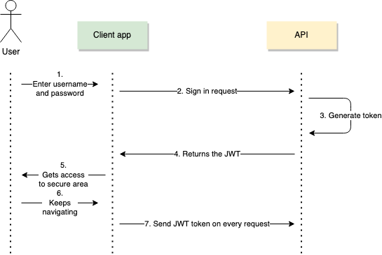

- [1 Coding Fast API](#1-coding-fast-api)
- [1.1 Refactoring structure](#11-refactoring-structure)
- [1.2 Splitting main.py using routers v1.1.5](#12-splitting-mainpy-using-routers-v115)
  - [Routing Prefix and tags](#routing-prefix-and-tags)
  - [2. Pydantic](#2-pydantic)
  - [1.3 Pydantic example](#13-pydantic-example)
    - [We need to define the schema and serializer:](#we-need-to-define-the-schema-and-serializer)
    - [And update the code](#and-update-the-code)
  - [1.4 Env Variables v1.1.11](#14-env-variables-v1111)
- [3. Relevant features](#3-relevant-features)
  - [1.6 Returning a personalizaed Http status with and without HTTPException (GET)](#16-returning-a-personalizaed-http-status-with-and-without-httpexception-get)
  - [1.7. Password hashing v1.1.4](#17-password-hashing-v114)
  - [Hashing User Password](#hashing-user-password)
  - [Adding *Utils.py* file function call.](#adding-utilspy-file-function-call)
- [5 Tokens and Login Flow v1.1.6](#5-tokens-and-login-flow-v116)
  - [JWT token components:](#jwt-token-components)
    - [Token obetention flow:](#token-obetention-flow)
  - [Login Flow](#login-flow)
    - [Code for the login](#code-for-the-login)
    - [Validating the password and the Email](#validating-the-password-and-the-email)
    - [Creating the token](#creating-the-token)
    - [Verify user access](#verify-user-access)
      - [Login Flow](#login-flow-1)
- [Functionalities](#functionalities)
  - [Cors v1.1.14](#cors-v1114)
    - [Cors](#cors)
  - [Postman Features](#postman-features)
    - [Calling the endpoints](#calling-the-endpoints)
- [Pydantic examples](#pydantic-examples)
  - [Creating the pydantic schema for request and response](#creating-the-pydantic-schema-for-request-and-response)
- [6 Vote try, except](#6-vote-try-except)
  - [Recover password logic](#recover-password-logic)
    - [Code Table :](#code-table-)
    - [Generating Code and forwarding mail:](#generating-code-and-forwarding-mail)
      - [Forwarding mail](#forwarding-mail)
    - [Endpoint for recieving , validating the code and updating the password](#endpoint-for-recieving--validating-the-code-and-updating-the-password)


# 1 Coding Fast API
- FastApi uses the following structure in whcih you define the endpoints and inside the endpoints there are the functions.
  
```python
 from fastapi import FastAPI #import the library
 from fastapi.params import Body

 app=FastAPI() #create instance of fastapi

 @app.get("/fran")#the route where to find the stuff /fran would be: http://127.0.0.1:8000/fran (decorator , endpoint)
 def root(): #root=funtion name (does not matter)
     return {"message": "Hello World"}

 @app.get("/posts")
 def get_posts():
     return{"data": "this is your posts"}

 @app.post("/createpost")
 def create_posts(payload: dict =Body(...)): #this gets the body from the post ,convert into a python dictionary and print save it into variable
     print (payload)
     return{"new_post": f"title: {payload['title']}"+" , succesfully created post"}

```
# 1.1 Refactoring structure
- To create a more modular structure the endpoints are goruped in giles based in its function and movedinto the /routers folder
- Chek the [main.py](../app/main.py) on how to reference them.

- In the in the root folder , inside app directory we can find config files which contains functions and other dependencies that the endpoints in router call to work.
# 1.2 Splitting main.py using routers v1.1.5

We are gonna split the **main.py** in two files one for users and the other for posts

1. Created a  folder named *routers* that contains 2 files *postst.py* and *users.py* .
2. These are acting now as independent files so we need to add the imports and the **ROUTER** object

*Posts example*


```Python
from fastapi import FastAPI, Response, status, HTTPException, Depends,APIRouter
from .. import schemas,models,utils,database
from  sqlalchemy.orm import Session
from typing import Optional, List

router= APIRouter()

@router.get("/posts",response_model=List[schemas.PostResponse]) #to retrieve all posts
def get_posts(db: Session = Depends(database.get_db)):
    posts=db.query(models.PostORM).all() #models=tables
    
    return posts #removing the dict and retunr the stuff  no data keyword

```
We need to update the *main.py*

```Python
from . routers import users,posts
models.Base.metadata.create_all(bind=engine)

app=FastAPI() #create instance of fastapi

app.include_router(posts.router)
app.include_router(users.router)

```
## Routing Prefix and tags
- The idea is to remove the need of copying the same path in each api endpoint such as "/posts/*something...*"
  ```Python
    router= APIRouter(
        prefix="/posts"
    )

  ```
  With this modification endpoint : **"/posts"** is converted to **"/"**

## 2. Pydantic

- Pydantic allows to define a schema for data validation, additionally, performs error handling

```python
from typing import Optional
from fastapi import FastAPI #import the library
from fastapi.params import Body
from pydantic import BaseModel

app=FastAPI() #create instance of fastapi

class Post (BaseModel): # here we use pydantic for define the schema
    title: str
    content: str
    published: bool = True # this is an optional/odefault to true
    rating: Optional[int]= None #Optional filed with no default value , type integer
    
    
```

## 1.3 Pydantic example
As we have Pydantic model to define the requst there are also pydantic models to difne the response

Currently base in our Pydantic schemas the request only is processed if acoomplish what is defines (tittle, content.. boleean.)

But the response is returned as it follows no control :


```Python
{
    "title": "test pydantic",
    "content": "third post from dell",
    "created_at": "2025-08-12T19:45:27.258204+02:00",
    "published": true,
    "id": 4
}
```
### We need to define the schema and serializer:
Additionally we have used a ``serializer`` to modify the datetime format for the **created_at** value before returning it to the user.
```Python
    class PostResponse (BaseModel): #This model defines the response that the user will get
    title: str
    content: str
    id: int
    created_at: datetime
    @field_serializer("created_at")
    def format_created_at(self, dt: datetime, _) -> str:
        return dt.strftime("%Y-%m-%d %H:%M")

 
```
### And update the code
We have added the ``response_model`` decorator so , FastApi will Update the response based in the Pydantic Shcema before fowarding it to the user.

```Python
   @app.post("/posts", status_code=status.HTTP_201_CREATED, response_model=schemas.PostResponse) #adding the post to a dict and to the my_post array of dict
   def create_posts(new_post: schemas.Post, db: Session = Depends(get_db)): #function expects new_post param. compliance with pydantic Post class


    #post = models.PostORM(title=new_post.title, content=new_post.content, published=new_post.published)
    post=models.PostORM(**new_post.dict())# This way we unpack the dictionary and put it in the same format the line above automatically
    db.add(post)
    db.commit()
    db.refresh(post)

    #return {"message_from_server": f"New post added!  Title: {post.title}"}
    return post
```
## 1.4 Env Variables v1.1.11
- Additionally Pyadntic will pick the env from the os and make it available for the app to consume it
- In order to not having  the info and sensitive info hardcoded , we create a ``.env`` file that contains the sensitive info in the followig format: (This file should be placed in the root directory)
```bash
 SQLALCHEMY_DATABASE_URL = VALUE
 
```
Then we are using the pydantic settings fo import the env variables as it follows in the ``config.py`` file:
```Python
from pydantic_settings import BaseSettings

class Settings(BaseSettings):
    SQLALCHEMY_DATABASE_URL:str

    class Config:
        env_file= ".env"


settings=Settings()
```
Accessing the varaibles:
```python
from .. config import settings

minutes=settings.ACCESS_TOKEN_EXPIRE_MINUTES
```

# 3. Relevant features


## 1.6 Returning a personalizaed Http status with and without HTTPException (GET)

**Adding it at decorator**
- useful for default operations
``@app.post("/posts", status_code=status.HTTP_201_CREATED)`` 

- Returning with exception
 
```python

from fastapi import FastAPI, Response, status, HTTPException

@app.get("/posts/{id}")  # Get post per id (decorator/path parameter)
def get_post(id: int,response: Response):#This generates an instance of Response class called "response"
    post = find_post(id)
    if post: #in python not empty values are considered as true same as: if post != {} (si no esta vacio... damelo else error)
        return {"post_info": post}  # Returns the entire post if found
    else:
        raise HTTPException(status_code=status.HTTP_404_NOT_FOUND, detail={"error": f"Post not found ID: {id}"})
        # response.status_code= status.HTTP_404_NOT_FOUND
        # return {"error": f"Post not found ID: {id}"}  # Returns an error message if no matching post is found

  # Returns an error message if no matching post is found

```
   

## 1.7. Password hashing v1.1.4


## Hashing User Password

For hashing the passwrod we need *passlib* and the *Bcrypt* algorithm for hashing
``pip install passlib[bcrypt]``

```python
from passlib.context import CryptContext

pwd_context=CryptContext(schemes=["bcrypt"], deprecated="auto")

@app.post("/useradd", status_code=status.HTTP_201_CREATED, response_model=schemas.UserResponse) 
def create_user(new_user: schemas.Useradd, db: Session = Depends(get_db)):

    #hash the password - new_user.password
    hashed_password=pwd_context.hash(new_user.password)
    new_user.password=hashed_password

    user=models.Users(**new_user.dict())# This way we unpack the dictionary and put it in the same format the line above automatically
    db.add(user)
    db.commit()
    db.refresh(user)

    #return {"message_from_server": f"New post added!  Title: {post.title}"}
    return user

```
## Adding *Utils.py* file function call.
In order to heave a more clean **main.py**  we create the **utils.py** file
We send the password filed from pydantic and it returns the hash that later is added to the ddbb.


# 5 Tokens and Login Flow v1.1.6

  - So in this section we are gonna use *JWT* for authentication purposes.
  - There are 2 main ways : *session based authentication* and *JWT* 
  - **Session based:** After a user logs in, the server creates a session and stores it (usually in memory or a database). The server then sends a session ID to the client, which is stored in a cookie. Is stateful, The server needs to remember the session 
  - **JWT:**After login, the server generates a token (like a JWT) and sends it to the client. The client stores it (usually in localStorage or a cookie) and sends it with each request. Is stateless, the server does not need to keep info , just verify the Token.
  
## JWT token components:

  - Header--> Tipically containes *metadata* about the token (hash:256 , type: jwt)
  - Payload-->Tipically contains the *username*
  - Signature: Signature is composed of the following: 
    - Header + Payload + password (hashed)
### Token obetention flow:

The image below describe the following steps:
1. User logs in
   1. The client sends credentials (like username and password) to the server.
2. Server provides the token
   1.  If credentials are valid, the server responds with a token (usually a JWT).
3. Client side now uses that token for every request performed
4. Now the client includes the Token in the header with: Header--> Authorization Bearer: (TOKEN) (this step is done automatically by the client app )



## Login Flow
1. The user provides user and passwrod , the password is in plain text and we have it stored as hash (onece is hashed it is not reversible)
2. The server will find the user and return the password (hashed).
3. Then we need to hash the password provided and confirm that the both hash are equal
   1. Passlib with [bcrypt] add the salt by default to the password so no password are equal between two users even the plain text is.
   
### Code for the login

 * We are adding the Response Object as is the tool that allows us to return cookies, headers (working with Token stuff)


### Validating the password and the Email
1. Here we are using the ``OAuth2PasswordRequestForm`` that will generate the variables
  - username
  - password
2. Then we do the query to find a user that matches with the mail provided
3. If the user is found, the password is check with the function located``utils.py`` 
4. In case the **hases** os the passwords match , the create token function is called and the token is returned

```Python
@router.post("/auth")
def sign_in(user_cred:OAuth2PasswordRequestForm=Depends(),db: Session = Depends(database.get_db)):
    user = db.query(models.Users).filter(models.Users.email == user_cred.username).first()

    if not user:
        raise HTTPException(status_code=status.HTTP_404_NOT_FOUND, detail= "Invalid credentials") #checks for the email
        
    if not utils.check(user_cred.password,user.password): # We are passing the user input and the aready stored passwod for compare hashing
        raise HTTPException(status_code=status.HTTP_404_NOT_FOUND, detail= "Invalid credentials") # checks the passwords match
    
    
    #Create token, we have used the user id as content of the token but can be any ohter field
    token=oauth.create_access_token(data={"user_id": user.id}) # we are passing the id in form of dictionary that is what is expecting
    #Return token
    return {"accestoken":token, "token_type": "bearer"}
    

    
```

### Creating the token 
[Token-creation](../app/oauth.py)
   - Once we have defined the code logic for the tokne creaiton in the previous step we need to generate the token , we need to install the following:
     ``pip install pyjwt`` or ``python-jose[cryptography]``  using the first here
     1. Create a new file in ide routers that will hold the logic, the code is the following:

       ``` Python 
           SECRET_KEY = "09d25e094faa6ca2556c818166b7a9563b93f7099f6f0f4caa6cf63b88e8d3e7"
           ALGORITHM = "HS256"
           ACCESS_TOKEN_EXPIRE_MINUTES = 30

          def create_access_token(data: dict):
            to_encode = data.copy()

            expire = datetime.now(timezone.utc) + timedelta(minutes=ACCESS_TOKEN_EXPIRE_MINUTES)
            to_encode.update({"exp": expire}) #Updating the varaibe, adding the expire time in the dict
            encoded_jwt = jwt.encode(to_encode, SECRET_KEY, algorithm=ALGORITHM)
            return encoded_jwt
       ```

- JWT Token compoents:


###  Verify user access
- The logic is as it follows:
  
-  We need to protect our branch such as (protects equals to adding the *Depends(oauth.get_current_user))* :
    ``` Python 
    @router.post("/", status_code=status.HTTP_201_CREATED, response_model=schemas.PostResponse)  my_post array of dict
    def create_posts(new_post: schemas.Post, db: Session = Depends(database.get_db),user_id:int=Depends(oauth.get_current_user)):         
    ```
-  This will call the ``oauth.get_current_user`` function before running. Additionally the ``oauth.get_current_user`` will leverage the oauth2_scheme = **OAuth2PasswordBearer**, if the correct token and theaders are provided  no error is raises from **OAuth2PasswordBearer** and ``oauth.get_current_user`` calls ``oauth.verify_access_token``
   -  ``` Python 
       oauth2_scheme = OAuth2PasswordBearer(tokenUrl="auth")

       def get_current_user(user_token: str= Depends(oauth2_scheme)):
        credentials_exception=HTTPException(status_code=status.HTTP_401_UNAUTHORIZED, detail= "Could not validte the Credentials",headers={"WWW-Authenticate": "Bearer"})
        return verify_access_token(user_token,credentials_exception)
    ```
**NOTE:** *oauth2_scheme, is a built-in fast api function that already is expecting the token in the following format:*
            ***Authorization: Bearer <token>*** so this mean we have to add the headers to define the token: 

- Finally the last function, if no error is raised the add post operation is performed.
  
  ``` Python 
       def verify_access_token(user_token:str,credentials_exception):
            try:
                payload=jwt.decode(user_token,SECRET_KEY,algorithm=ALGORITHM)
                id=payload.get("user_id") #Here we are geting the payload we have configured (the id)
                
                if id is None:
                    raise HTTPException(status_code=status.HTTP_400_BAD_REQUEST, detail= "Not authenticated")
                
                #token_data=schemas.TokenData(id=id) in case validation is needed
                
            except  InvalidTokenError:
                raise credentials_exception
            
            return id

    ```

We can also add another except in case the error is because of the token expiration:

``` Python 
      except ExpiredSignatureError:
        raise HTTPException(status_code=status.HTTP_401_UNAUTHORIZED, detail= "Session Expired", headers={"WWW-Authenticate": "Bearer"})
      except  InvalidTokenError:
        raise credentials_exception
    
    
    else:
    
        return id

```

Basically we are performing a validation from multiple dependencies/functions and if no error is raised the function of the apo endpoint is granted like adding a post.

#### Login Flow
1. Reach the Path **/auth** using a POST request if creadentials are correct a signed token is provided
2. when reaching a protected branch add the Header **Authorization: Bearer <token>** the protected enpoint function will call the *get_current_user* function
3. *get_current_user* function will obetain the token from the *oauth2_scheme*  after its built-in validation
4. *get_current_user* function will call *verify_access_token* will decode and verify the token using the **SECRET_KEY** if all is fine no error will raised, the id embeeded in the token will be returned and the operation from the protected endpoint will be completed.


# Functionalities


##  Cors v1.1.14
### Cors 
[main.py](app/main.py)
- Allows requests from different origins
- If not enabled, only request from the same Domain is allowed
- Test from browser (console) in a webpage:
``` Javascript
fetch("http://localhost:8000/", {
  method: "GET",
  mode: "cors"
})
  .then(response => response.text())
  .then(data => console.log("✅ Respuesta:", data))
  .catch(error => console.error("❌ Error CORS:", error));


```

## Postman Features
- Environtments: Allows you to define variables based in the environment that you are working in.

- Automate token  retrival and Login:
  - In the user login we are gona set the following in the test, (scripts/post response) we are getting the token value in json and storing it as variable
```Java

pm.environment.set("token",pm.response.json().access_token);

console.log(pm.environment.get("token"));
```
 - Then in the *authorization* of the desired endpoint, we hjust have to add the variable ``{{token}}`` (REMEMBER TO SELECT THE CORRECT ENVIRONMENT)
  
### Calling the endpoints


# Pydantic examples

## Creating the pydantic schema for request and response 

**REQUEST**
```python
class Useradd(BaseModel):
    email:EmailStr
    password:str
```
**RESPONSE**
In this Schema additionally to the serilaizer for the date time there is one for sending a message in the response.

```python
class UserResponse (BaseModel):
    email:str
    created_at: datetime

    @field_serializer("created_at")
    def format_created_at(self, dt: datetime, _) -> str:
        return dt.strftime("%Y-%m-%d %H:%M")
    

    @computed_field # This is for sending  a message
    @property
    def message(self) -> str:
        # now you can refer to self.email
        return f"User {self.email!r} created successfully" # !r is for obtaining the mail between quotes

```

# 6 Vote try, except
[vote.py](app/routers/vote.py)
- Users should be able to like a Post
- Users can only like a post Once We handle this using the try and except by catching the error trhown by the DDBB thanks to the composite key.
- Retrieving posts should also fetch the number of likes
- Shemas constraint , pydantic range
- For making sure that an user can only like apost once we will create a new table (votes) with a composed key (users.id and post.id). We make sure that post.id and users.id relationship only exists once per post and user


## Recover password logic
1. Create and endpoint that recieves the user email
2. generate a code and store it alongside the email in a new table so the code corresponds to a user additionally , add a expires_at field
3. share this code trhough email
4. generate a new endpint asking the user for the email, the  code and the new password, if the validations are passed , updates the password


### Code Table :

``models.py``

```Python
class Code(Base):
    __tablename__="code"
    id=Column(Integer, primary_key=True, nullable= False)
    code=Column(String,nullable=False)
    email= Column(String, nullable=False)
    expires_at=Column(TIMESTAMP(timezone=True), server_default=text('now()'), nullable=False)
      
```
### Generating Code and forwarding mail:
[/recover_password](../app/routers/users.py)
- This endpoint triggers the forward mail function. 

#### Forwarding mail
- The function in [mail.py](../app/mail.py) will forward the mail with the code
### Endpoint for recieving , validating the code and updating the password

- In the folllowing endpoint the user will be able to input the code and update the password
[/update_password](../app/routers/users.py)


